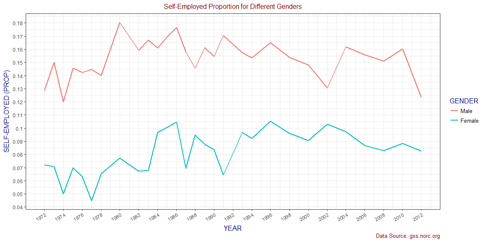
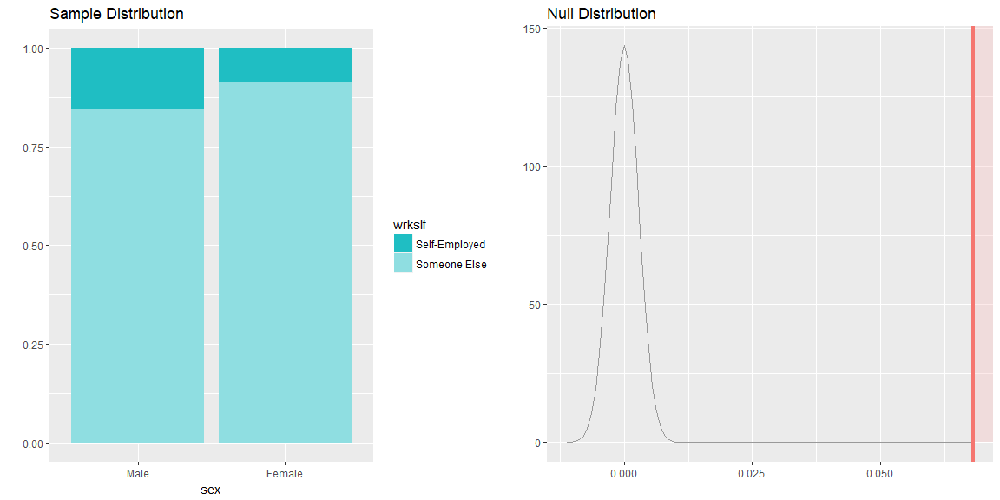

# Research Case: Gender and Religion Differences in Entrepreneurship

## Introduction
The General Social Survey (GSS) is a comprehensive study that aims to monitor societal changes and understand various aspects of American society. It collects data to analyze trends, attitudes, behaviors, and attributes, compare the United States to other societies, and provide accessible data for researchers, policymakers, students, and other stakeholders. In this research case, we investigate the differences in entrepreneurship between genders and across different religions using the GSS data.

## Part 1: Data
The GSS dataset, which has been loaded into the R environment, serves as the primary source of information for this analysis. It contains variables such as gender, religion, employment type (self-employed or working for someone else), and year.

``` r
load("gss.Rdata")

gss_slf <- gss %>%
    select(sex, relig, wrkslf, year) %>%
    filter(!is.na(sex), !is.na(relig), !is.na(wrkslf), !is.na(year))
```

## Part 2: Research Question
The research question of interest is twofold:
1. Are there any differences in entrepreneurship between genders?
2. Are there any differences in entrepreneurship across different religions?

## Part 3: Exploratory Data Analysis
To explore the research question, we conducted exploratory data analysis using visualizations.

1. Gender Differences in Entrepreneurship:
We analyzed the self-employment proportions for different genders across different years. The line plot demonstrates the trends in self-employment proportions over time for males and females. The analysis revealed a significant difference in the sample proportions of self-employed individuals between the two genders.

``` r
gss_slf %>%
     group_by(year,sex,wrkslf) %>%
     summarise(N = n()) %>% 
     mutate(N = N/max(cumsum(N))) %>%
     filter(wrkslf == "Self-Employed") %>%
     ggplot(aes(x = year, y = N, color = sex)) + 
     geom_line(size = .9) + 
     theme_bw() + 
     labs(title = "Self-Employed Proportion for Different Genders", caption = "Data Source: gss.norc.org",
     x = "YEAR", y = "SELF-EMPLOYED (PROP)")+
     scale_x_continuous(breaks = seq(1972,2012,2), labels = seq(1972,2012,2)) +
     scale_y_continuous(breaks = seq(.04,.20,.01), labels = seq(.04,.20,.01)) +
     scale_color_discrete(name = "GENDER")+
     theme(plot.title = element_text(size = 12, color = "darkred", hjust = .5),
           plot.caption = element_text(color = "darkred"),
           axis.text.x = element_text(size = 9,angle = 30, hjust = 1), 
           axis.title = element_text(family = "Times", size = 12, color = "darkblue"),
           legend.title = element_text(size = 12, family = "Times", color = "darkblue"), 
           legend.text = element_text(size = 10))
```



2. Religion Differences in Entrepreneurship:
We examined the self-employment proportions for individuals belonging to different religions. The scatter plot represents the proportions of self-employed individuals for various religions over time. The analysis indicates a significant difference in the sample proportions of self-employed individuals across different religious groups.

``` r
gss_slf %>%
     mutate(relig = fct_recode(relig, "Other" = "None", "Other" = "Other Eastern", 
                               "Other" = "Inter-Nondenominational")) %>%
     group_by(year, relig, wrkslf) %>%
     summarise(N = n()) %>% 
     mutate(N = N/max(cumsum(N)))%>%
     filter(wrkslf == "Self-Employed", year >= 2000) %>%
     ggplot(aes(x = factor(year), y = relig, size =  N)) +
     geom_point(shape = 21, fill = "cornsilk", color = "black") + 
     scale_size_area(name = "PROPOTION", guide = FALSE, max_size = 14)+
     geom_text(aes(y = as.numeric(relig) - sqrt(N)/5, label = round(N, 2)), color = "grey60", size = 4, vjust = 2)+
     labs(title = "Self-Employed Proportion for Different Religions", caption = "Data Source: gss.norc.org",
     x = "YEAR", y = "RELIGION")+
     theme(plot.title = element_text(size = 12, color = "darkred", hjust = .5),
           plot.caption = element_text(color = "darkred"),
           axis.text.x = element_text(size = 10, angle = 30, hjust = 1, color = "black"), 
           axis.text.y = element_text(size = 10, color = "black"),
           axis.title = element_text(family = "Times", size = 12, color = "darkred"))
```


## Part 4: Inference
To draw conclusions about the research question, we conducted hypothesis testing.

1. Gender Differences in Entrepreneurship:
Null Hypothesis: There is no difference in the proportions of self-employed individuals between genders.
Alternative Hypothesis: The proportion of self-employed males is greater than the proportion of self-employed females.
We performed a t-test for proportions, which resulted in a very low p-value. Consequently, we rejected the null hypothesis and concluded that there is convincing evidence of a higher proportion of self-employed men compared to self-employed women in the U.S.

``` r
inference(data = gss_slf, x = sex, y = wrkslf,
          statistic = "proportion", type = "ht", null = 0, success = "Self-Employed", 
          alternative = "greater", method = "theoretical")
```

    ## Response variable: categorical (2 levels, success: Self-Employed)
    ## Explanatory variable: categorical (2 levels) 
    ## n_Male = 24423, p_hat_Male = 0.1527
    ## n_Female = 28932, p_hat_Female = 0.0846
    ## H0: p_Male =  p_Female
    ## HA: p_Male > p_Female
    ## z = 24.4841
    ## p_value = < 0.0001



2. Religion Differences in Entrepreneurship:
Null Hypothesis: There is no difference in the proportions of self-employed individuals across different religions.
Alternative Hypothesis: There is a difference in the proportions of self-employed individuals between at least two religious groups.
Using a chi-squared goodness-of-fit test, we obtained a p-value close to zero, leading us to reject the null hypothesis. The results provide compelling evidence of differences in self-employment proportions among various religious groups.

``` r
# proportion of each group of respondants
gss_relig_prop <- gss_slf %>%
    group_by(relig) %>%
    summarise(prop = n()/dim(gss_slf)[1]) 

# observed counts of self-employed people with different religions.
gss_relig_counts <- gss_slf %>% 
  filter(wrkslf == "Self-Employed") %>%
  group_by(relig) %>%
  summarise(obs_counts = n())

# merge 
gss_slf_relig <- left_join(gss_relig_prop, gss_relig_counts)

# Chi-Squared goodness of fit
chisq.test(x = gss_slf_relig$obs_counts, p = gss_slf_relig$prop)
```

    ## 
    ##  Chi-squared test for given probabilities
    ## 
    ## data:  gss_slf_relig$obs_counts
    ## X-squared = 169.26, df = 12, p-value < 2.2e-16

## Conclusion
Based on the analysis, we can conclude that there are significant differences in entrepreneurship between genders and across different religions. These findings contribute to a better understanding of the role gender and religion play in entrepreneurial activities and highlight the need for further research and policy considerations in promoting entrepreneurship in different demographic groups.
