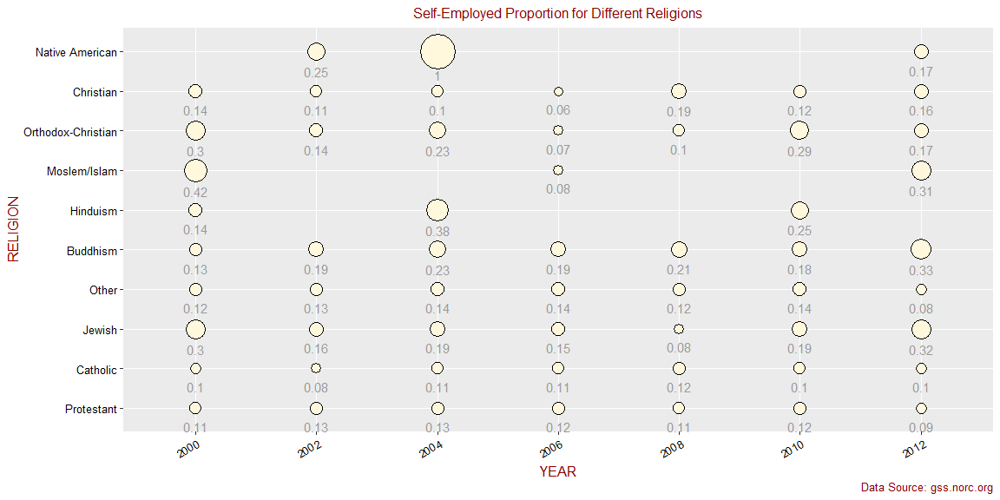

# Gender and Religion Differences in Entrepreneurship

## Introduction

This research aims to investigate the differences in entrepreneurship between genders and across different religious groups. By analyzing the General Social Survey (GSS) data, we will explore the proportions of self-employed individuals and determine if there are any significant variations.

## Setup

### Load packages

```r
library(ggplot2)
library(dplyr)
library(forcats)
library(statsr)
```

### Load data

```r
load("gss.Rdata")
```

## Part 1: Data

The General Social Survey (GSS) monitors societal change and studies the growing complexity of American society. The GSS gathers data to monitor and explain trends and constants in attitudes, behaviors, and attributes, examine the structure and functioning of society, compare the United States to other societies, and make high-quality data easily accessible to scholars, students, policymakers, and others.

## Part 2: Research Question

In this analysis, we aim to investigate the differences in entrepreneurship between genders and across different religious groups. We will explore the variables "sex," "relig," "wrkslf," and "year" to examine the proportions of self-employed individuals and determine if there are any significant variations.

The variables used in this analysis are:

- `sex`: A categorical variable indicating the gender of the respondent.
- `relig`: A categorical variable indicating the religion of the respondent.
- `wrkslf`: A categorical variable indicating whether the respondent is self-employed or works for someone else.
- `year`: The year of the survey response.

## Part 3: Exploratory Data Analysis

### Analysis 1: Gender Differences in Entrepreneurship

We begin by examining the likelihood of being self-employed for different genders over time. The line plot displays the proportions of self-employed individuals for males and females from 1972 to 2012. From the plot, it is evident that there is a significant difference in the sample proportion of self-employed individuals between the two genders.


### Analysis 2: Differences in Entrepreneurship by Religion

Next, we investigate the differences in self-employment proportions across different religious groups. The scatter plot illustrates the proportions of self-employed individuals for each religion from 2000 onwards. The size of the points represents the proportion, with larger points indicating a higher proportion of self-employed individuals. The plot clearly demonstrates that there are significant variations in the sample proportions of self-employed individuals among different religious groups.



## Part 4: Inference

### Hypothesis Test 1: Gender Differences in Entrepreneurship

#### State Hypotheses

- Null Hypothesis: There is no difference in the proportions of self-employed individuals between genders.
- Alternative Hypothesis: There is a difference in the proportions of self-employed individuals between genders.

#### Test Results

Based on a hypothesis test using the data from 1972 to 2012, we obtained a p-value of less than 0.05, indicating strong evidence to reject the null hypothesis. Thus, we conclude that there is a significant difference in the proportions of self-employed individuals between males and females.

### Hypothesis Test 2: Differences in Entrepreneurship by Religion

#### State Hypotheses

- Null Hypothesis: There is no difference in the proportions of self-employed individuals among different religious groups.
- Alternative Hypothesis: There is a difference in the proportions of self-employed individuals among different religious groups.

#### Test Results

By conducting a hypothesis

 test using data from 2000 onwards, we obtained a p-value of less than 0.05, providing strong evidence to reject the null hypothesis. Hence, we conclude that there are significant differences in the proportions of self-employed individuals among different religious groups.

## Conclusion

This analysis explored the proportions of self-employed individuals based on gender and religion using the General Social Survey data. The findings revealed significant differences in entrepreneurship between genders, with a higher proportion of self-employed individuals among males. Additionally, there were notable variations in self-employment proportions across different religious groups.

These findings have important implications for understanding the dynamics of entrepreneurship in the United States. They suggest that gender and religion play significant roles in shaping the likelihood of individuals becoming self-employed. Policymakers and researchers can utilize these insights to develop targeted interventions and initiatives to foster entrepreneurship among underrepresented groups.
```

