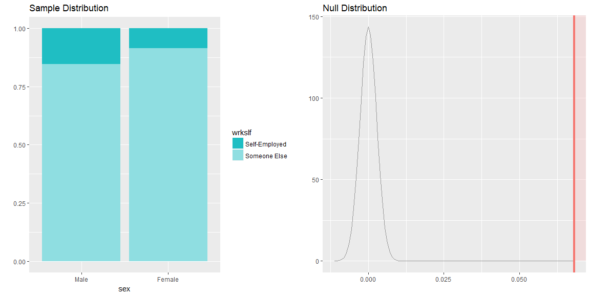

Setup
-----

### Load packages

``` r
library(ggplot2)
library(dplyr)
library(forcats)
library(statsr)
```

### Load data

``` r
load("gss.Rdata")
```

------------------------------------------------------------------------

Part 1: Data
------------

The General Social Survey (GSS) monitors societal change and studies the growing complexity of American society. The GSS \[gathers data\] in order to monitor and explain trends and constants in attitudes, behaviors, and attributes; to examine the structure and functioning of society in general as well as the role played by relevant subgroups; to compare the United States to other societies in order to place American society in comparative perspective and develop cross-national models of human society; and to make high-quality data easily accessible to scholars, students, policy makers, and others, with minimal cost and waiting.


------------------------------------------------------------------------

Part 2: Research question
-------------------------

**Are there any differences between the two genders in entrepreneurship. Also for people with different religions, is there any difference**

*The variables used in this analysis are:*

-   sex: A categorical variable indicating the gender of the respondent.
-   relig: A categorical variable indicating the religion of the respondent
-   wrkslf: A categorical variable indicating whether the respondent is self-employed or works for someone else.
-   year: I expect the proportions to have increased across the years moving from 1972 to 2012.

``` r
gss_slf <- gss %>%
    select(sex, relig, wrkslf, year) %>%
    filter(!is.na(sex), !is.na(relig), !is.na(wrkslf), !is.na(year))
```

------------------------------------------------------------------------

Part 3: Exploratory data analysis
---------------------------------

**1- Does the likelihood of being self-employed differ significantly by gender?**

``` r
gss_slf %>%
     group_by(year,sex,wrkslf) %>%
     summarise(N = n()) %>% 
     mutate(N = N/max(cumsum(N))) %>%
     filter(wrkslf == "Self-Employed") %>%
     ggplot(aes(x = year, y = N, color = sex)) + 
     geom_line(size = .9) + 
     theme_bw() + 
     labs(title = "Self-Employed Proportion for Different Genders", caption = "Data Source: gss.norc.org",
     x = "YEAR", y = "SELF-EMPLOYED (PROP)")+
     scale_x_continuous(breaks = seq(1972,2012,2), labels = seq(1972,2012,2)) +
     scale_y_continuous(breaks = seq(.04,.20,.01), labels = seq(.04,.20,.01)) +
     scale_color_discrete(name = "GENDER")+
     theme(plot.title = element_text(size = 12, color = "darkred", hjust = .5),
           plot.caption = element_text(color = "darkred"),
           axis.text.x = element_text(size = 9,angle = 30, hjust = 1), 
           axis.title = element_text(family = "Times", size = 12, color = "darkblue"),
           legend.title = element_text(size = 12, family = "Times", color = "darkblue"), 
           legend.text = element_text(size = 10))
```


*There is a significant difference in the sample proportion of self-employed for different genders.*

**1- Does the likelihood of being self-employed differ significantly by religion?**

``` r
gss_slf %>%
     mutate(relig = fct_recode(relig, "Other" = "None", "Other" = "Other Eastern", 
                               "Other" = "Inter-Nondenominational")) %>%
     group_by(year, relig, wrkslf) %>%
     summarise(N = n()) %>% 
     mutate(N = N/max(cumsum(N)))%>%
     filter(wrkslf == "Self-Employed", year >= 2000) %>%
     ggplot(aes(x = factor(year), y = relig, size =  N)) +
     geom_point(shape = 21, fill = "cornsilk", color = "black") + 
     scale_size_area(name = "PROPOTION", guide = FALSE, max_size = 14)+
     geom_text(aes(y = as.numeric(relig) - sqrt(N)/5, label = round(N, 2)), color = "grey60", size = 4, vjust = 2)+
     labs(title = "Self-Employed Proportion for Different Religions", caption = "Data Source: gss.norc.org",
     x = "YEAR", y = "RELIGION")+
     theme(plot.title = element_text(size = 12, color = "darkred", hjust = .5),
           plot.caption = element_text(color = "darkred"),
           axis.text.x = element_text(size = 10, angle = 30, hjust = 1, color = "black"), 
           axis.text.y = element_text(size = 10, color = "black"),
           axis.title = element_text(family = "Times", size = 12, color = "darkred"))
```


*There is a significant difference in the sample proportion of self-employed for each religion group.*

------------------------------------------------------------------------

Part 4: Inference
-----------------

**1- Does the likelihood of being self-employed differ significantly by gender**

**State Hypothesis**

**Null Hypothesis**: The difference in proportions of self-employed between two genders is zero.    
**Alternative Hypothesis**: Proportion of self-employed males is greater than Proportion of self-employed females.

**Check Conditions**

**1. Independence**: The observations in each group are independent from the random sampling conducted in GSS survey.   
**2. Sample size**: To check the sample size, we need to find out first the pooled proportion which is expressed in this context as number of self-employed men and women / total number of men and women.

``` r
gss_slf %>%
  summarise(
            n_female_success = sum(sex == "Female")*sum(wrkslf=="Self-Employed")/n(),
            n_female_fails = sum(sex == "Female")*(1-sum(wrkslf=="Self-Employed")/n()),
            n_male_success = sum(sex == "Male")*sum(wrkslf=="Self-Employed")/n(),
            n_male_fails = sum(sex == "Male")*(1-sum(wrkslf=="Self-Employed")/n()))
```

    ##   n_female_success n_female_fails n_male_success n_male_fails
    ## 1         3349.507       25582.49       2827.493     21595.51

**t-test**

``` r
inference(data = gss_slf, x = sex, y = wrkslf,
          statistic = "proportion", type = "ht", null = 0, success = "Self-Employed", 
          alternative = "greater", method = "theoretical")
```

    ## Response variable: categorical (2 levels, success: Self-Employed)
    ## Explanatory variable: categorical (2 levels) 
    ## n_Male = 24423, p_hat_Male = 0.1527
    ## n_Female = 28932, p_hat_Female = 0.0846
    ## H0: p_Male =  p_Female
    ## HA: p_Male > p_Female
    ## z = 24.4841
    ## p_value = < 0.0001



*With the p-value &lt;= 0.0001, we reject the null hypothesis. We have convincing evidence that the proportion of self-employed men is greater than proportion of self-employed women in the U.S.*

**2- Does the likelihood of being self-employed differ significantly by gender or religion?**

**Hypothesis**

**Null Hypothesis**: There is no difference in proportions of self-employed people with different religions, and any observed differences are due to chance.      
**Alternative Hypothesis**: There is a difference in proportion f self-employed between at least two groups.

*Since There are two Ctegorical variables, with a variable (relig) which contains more than two levels, the performed test is chi-sq test.*
**Check Conditions**

**1. Independence**: The observations in each group are independent from the random sampling conducted in GSS survey.    
**2. Expected counts**: The expected count is above the minimum of 5 for each cell.

**Chi-Squared goodness of fit**

``` r
# proportion of each group of respondants
gss_relig_prop <- gss_slf %>%
    group_by(relig) %>%
    summarise(prop = n()/dim(gss_slf)[1]) 

# observed counts of self-employed people with different religions.
gss_relig_counts <- gss_slf %>% 
  filter(wrkslf == "Self-Employed") %>%
  group_by(relig) %>%
  summarise(obs_counts = n())

# merge 
gss_slf_relig <- left_join(gss_relig_prop, gss_relig_counts)

# Chi-Squared goodness of fit
chisq.test(x = gss_slf_relig$obs_counts, p = gss_slf_relig$prop)
```

    ## 
    ##  Chi-squared test for given probabilities
    ## 
    ## data:  gss_slf_relig$obs_counts
    ## X-squared = 169.26, df = 12, p-value < 2.2e-16

*With the p-value ~ 0, we reject the null hypothesis. We have convincing evidence that the proportion of self-employed for at least two groups of people with different religions is different.*
